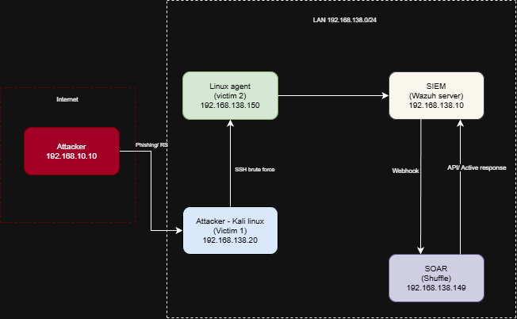

1. Mục đích thiết kế mạng
Môi trường mạng được thiết kế nhằm mô phỏng hệ thống mạng nội bộ của một doanh nghiệp vừa và nhỏ, trong đó kẻ tấn công đã có được chỗ đứng bên trong mạng (internal attacker / compromised host). Các mục tiêu cụ thể bao gồm:
- Mô phỏng kịch bản tấn công nội bộ thực tế: kẻ tấn công đã vượt qua perimeter và đang hoạt động bên trong mạng doanh nghiệp
- Cho phép thực hiện các kỹ thuật tấn công từ máy Attacker đến các máy nạn nhân trong cùng phân vùng mạng
- Thu thập và phân tích log tập trung thông qua Wazuh Server (SIEM)
- Tích hợp hệ thống tự động hóa phản ứng sự cố thông qua Shuffle (SOAR)
- Kiểm tra khả năng phát hiện tấn công của hệ thống dựa trên rule và tương quan sự kiện

2. Kiến trúc tổng thể
Toàn bộ môi trường lab được triển khai trên các máy ảo (VMware/VirtualBox), cấu hình trong cùng một dải mạng nội bộ 192.168.138.0/24.
```
Thành phần    Vai trò               Hệ điều hành        IP                      Ghi chú
Kali        Attacker(victim1)         Kali Linux      192.168.138.20        Công cụ: Hydra, Nmap, Netcat
Ubuntu      AgentVictim 2             Ubuntu 22.04    192.168.138.150       Wazuh Agent, SSH enabled
Wazuh Server    SIEM                  Ubuntu 22.04    192.168.138.10        Wazuh Manager + Dashboard
Shuffle         SOAR                  Ubuntu 22.04    192.168.138.149       Tự động hóa phản ứng sự cố
```

3. Phân vùng và luồng kết nối
Tất cả các máy nằm trong cùng một subnet 192.168.138.0/24, mô phỏng một flat network nội bộ trong doanh nghiệp nhỏ chưa áp dụng phân đoạn mạng (network segmentation). Khi không có sự phân tách giữa các vùng mạng, một máy bị chiếm là bàn đạp để kẻ tấn công leo thang và duy trì quyền truy cập trên chính máy đó trước khi mở rộng ra.
Luồng tấn công:
- Kali Linux → Ubuntu Agent: Brute Force SSH (port 22) → Credential Access → Privilege Escalation → Persistence

Luồng giám sát:
- Ubuntu Agent → Wazuh Server: Wazuh Agent gửi log liên tục về SIEM (port 1514)

Luồng phản ứng:
- Wazuh Server → Shuffle: Khi alert đạt ngưỡng (Level 10), Wazuh gửi webhook đến Shuffle (port 443)
- Shuffle thực hiện các hành động tự động: gửi email cảnh báo đến admin, tạo ticket sự cố, kích hoạt Active Response block IP kẻ tấn công

4. Mô hình kết nối


