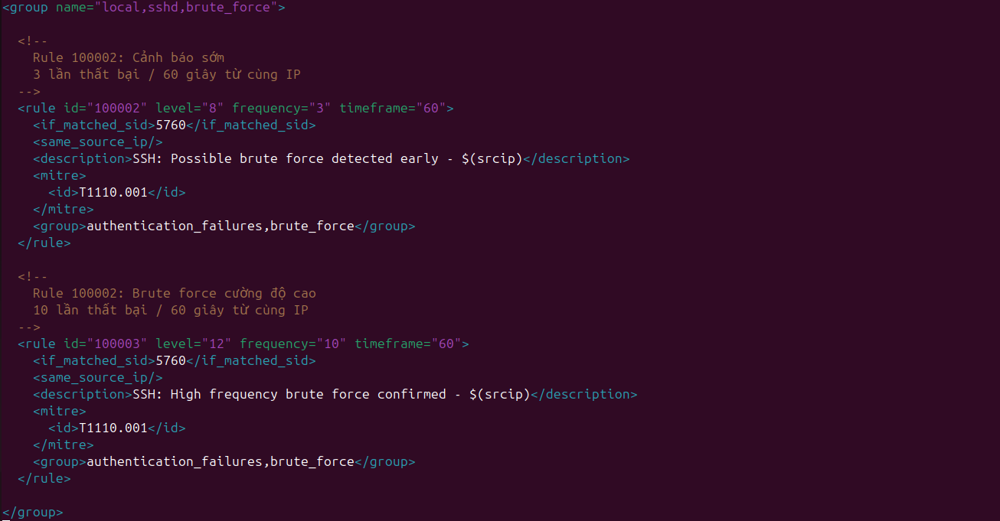
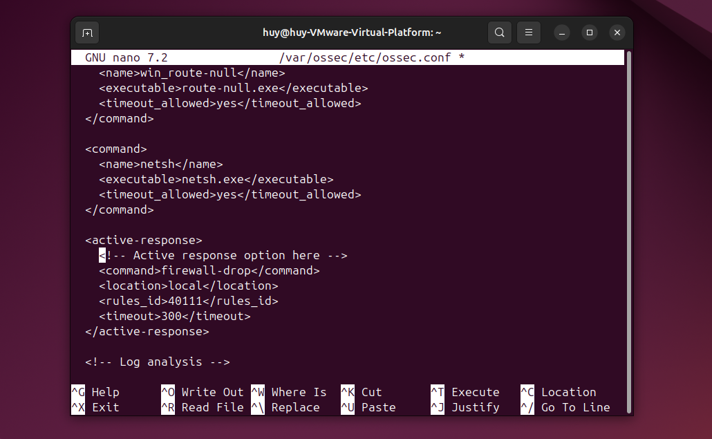
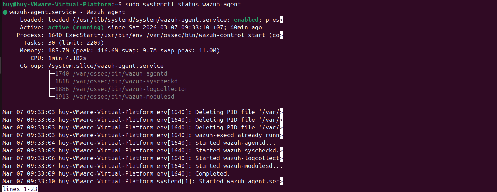
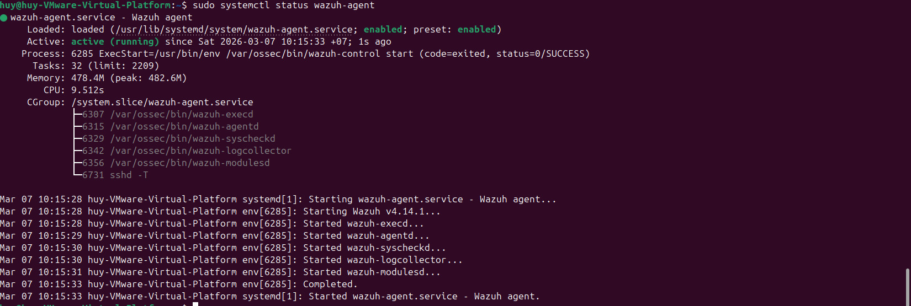
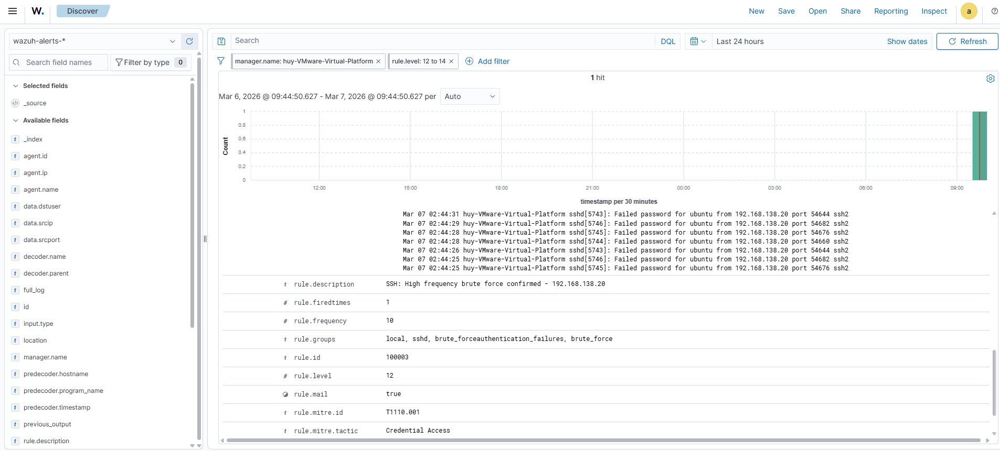
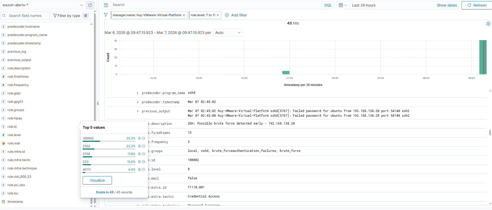
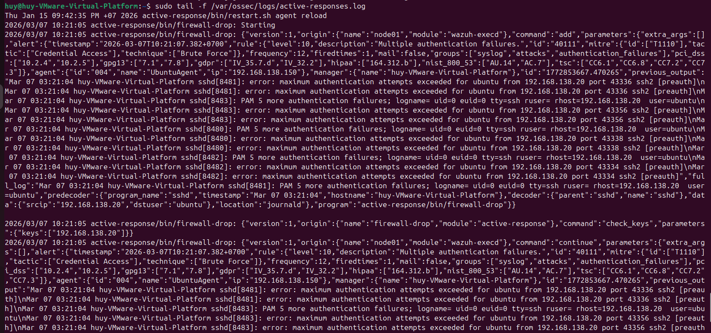
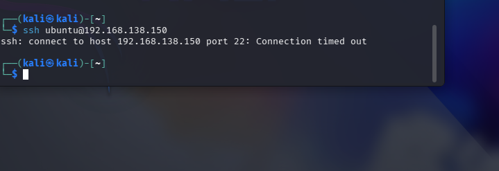

## 1. Tổng quan
- File này mô tả các rule Wazuh được sử dụng để phát hiện tấn công Brute Force SSH, bao gồm các rule mặc định có sẵn, custom rule bổ sung để tăng độ nhạy phát hiện, cấu hình Active Response tự động block IP kẻ tấn công, và cách kiểm tra rule hoạt động đúng.

## 2. Các rule mặc định của Wazuh
- Các rule mặc định của Wazuh sẽ nằm tại: ```/var/ossec/ruleset/rules/0095-sshd_rules.xml```

### Rule 5503 — PAM Authentication Failure
```
<rule id="5503" level="5">
    <if_sid>5500</if_sid>
    <match>authentication failure; logname=</match>
    <description>PAM: User login failed.</description>
    <group>authentication_failed,pci_dss_10.2.4,pci_dss_10.2.5,gpg13_7.8,gdpr_IV_35.7.d,gdpr_IV_32.2,hipaa_164.312.b,nist_800_53_AU.14,nist_800_53_AC.7,tsc_CC6.1,tsc_CC6.8,tsc_CC7.2,tsc_CC7.3,</group>
  </rule>
```

### Rule 5760 — SSH Failed Password
```
<rule id="5760" level="5">
    <if_sid>5700,5716</if_sid>
    <match>Failed password|Failed keyboard|authentication error</match>
    <description>sshd: authentication failed.</description>
    <mitre>
      <id>T1110.001</id>
      <id>T1021.004</id>
    </mitre>
    <group>authentication_failed,gdpr_IV_35.7.d,gdpr_IV_32.2,gpg13_7.1,hipaa_164.312.b,nist_800_53_AU.14,nist_800_53_AC.7,pci_dss_10.2.4,pci_dss_10.2.5,tsc_CC6.1,tsc_CC6.8,tsc_CC7.2,tsc_CC7.3,</group>
  </rule>
```

### Rule 2501 — Failed login
```
<group name="syslog,access_control,">
  <rule id="2501" level="5">
    <match>FAILED LOGIN |authentication failure|</match>
    <match>Authentication failed for|invalid password for|</match>
    <match>LOGIN FAILURE|auth failure: |authentication error|</match>
    <match>authinternal failed|Failed to authorize|</match>
    <match>Wrong password given for|login failed|Auth: Login incorrect|</match>
    <match>Failed to authenticate user</match>
    <group>authentication_failed,pci_dss_10.2.4,pci_dss_10.2.5,gpg13_7.8,gdpr_IV_35.7.d,gdpr_IV_32.2,hipaa_164.312.b,nist_800_53_AU.14,nist_800_53_AC.7,tsc_CC6.1,tsc_CC6.8,tsc_CC7.2,tsc_CC7.3,</group>
    <description>syslog: User authentication failure.</description>
  </rule>
```
### Rule 40111 — Multiple Authentication Failures
```
<rule id="40111" level="10" frequency="12" timeframe="160">
    <if_matched_group>authentication_failed</if_matched_group>
    <same_source_ip />
    <description>Multiple authentication failures.</description>
    <mitre>
      <id>T1110</id>
    </mitre>
    <group>authentication_failures,pci_dss_10.2.4,pci_dss_10.2.5,gpg13_7.1,gpg13_7.8,gdpr_IV_35.7.d,gdpr_IV_32.2,hipaa_164.312.b,nist_800_53_AU.14,nist_800_53_AC.7,tsc_CC6.1,tsc_CC6.8,tsc_CC7.2,tsc_CC7.3,</group>
  </rule>
```

## 3. Custom rule
- Các rule được thêm sẽ nằm tại: ``` /var/ossec/etc/rules/local_rules.xml```

### Rule 100002: Early alert
```
  <rule id="100002" level="8" frequency="3" timeframe="60">
    <if_matched_sid>5760</if_matched_sid>
    <same_source_ip/>
    <description>SSH: Possible brute force detected early - $(srcip)</description>
    <mitre>
      <id>T1110.001</id>
    </mitre>
    <group>authentication_failures,brute_force</group>
  </rule>
```

### Rule 100003: High-intensity bruteforce
```
<rule id="100003" level="12" frequency="10" timeframe="60">
    <if_matched_sid>5760</if_matched_sid>
    <same_source_ip/>
    <description>SSH: High frequency brute force confirmed - $(srcip)</description>
    <mitre>
      <id>T1110.001</id>
    </mitre>
    <group>authentication_failures,brute_force</group>
  </rule>
```

## 4. Active response
- Wazuh Active Response cho phép tự động thực thi hành động khi một rule kích hoạt — trong trường hợp này là block IP kẻ tấn công ngay khi phát hiện brute force
- Mở file cấu hình của Wazuh ```/var/ossec/etc/ossec.conf```

```
<active-response>
  <command>firewall-drop</command> // dùng script có sẵn của Wazuh để block IP bằng iptables
  <location>local</location>       // chạy trên chính máy agent bị tấn công
  <rules_id>40111</rules_id>       // chỉ kích hoạt khi rule 40111 fired
  <timeout>300</timeout>           //  block IP trong 300 giây
</active-response>
```
- Nếu muốn tự động hóa phản hồi sự cố thì bên phía agent phải bật wazuh-execd. Tiến hành kiểm tra bằng câu lệnh: ```sudo systemctl status wazuh-agent```

- Chúng tra có thể thấy trong các service đang chạy thì không có sự xuất hiện của wazuh-execd.
- Ta chạy service bằng câu lệnh: ```sudo /var/ossec/bin/wazuh-execd```
- Khởi động lại wazuh-agent: ```sudo systemctl restart wazuh-agent```
- Kiểm tra lại dịch vụ: ```sudo systemctl status wazuh-agent```


## 5. Kiểm tra rule
- Tiến hành chạy lại kịch bản brute force từ máy kali


- Ta có thể thấy rằng rule 100002 và 100003 đang hoạt động tốt

- Ta kiểm tra phản hồi sự cố bên máy agent: ```sudo tail -f /var/ossec/logs/active-responses.log```

- Sau khi khởi động wazuh-execd, tiến hành chạy lại kịch bản brute force từ Kali. Theo dõi file active-responses.log trên Ubuntu Agent, hệ thống ghi nhận toàn bộ quá trình phản ứng tự động
```
active-response/bin/firewall-drop: Starting //Khởi động script
```
- Ngay khi rule 40111 kích hoạt trên Wazuh Server, Server lập tức gửi tín hiệu xuống wazuh-execd trên Ubuntu Agent để thực thi script firewall-drop. 
- Wazuh Server gửi toàn bộ context của alert xuống agent dưới dạng JSON với "command":"add" — lệnh yêu cầu block IP.
```
rule.id: 40111, level: 10 — alert kích hoạt lệnh này
srcip: 192.168.138.20 — IP cần block
agent.id: 004, agent.name: UbuntuAgent — agent thực thi
mitre.technique: Brute Force, tactic: Credential Access — phân loại kỹ thuật tấn công
```
- Kiểm tra trc khi block:
```
"command":"check_keys","parameters":{"keys":["192.168.138.20"]}
```
- Trước khi thực hiện block, script kiểm tra xem IP 192.168.138.20 đã tồn tại trong danh sách block chưa — tránh block trùng hoặc xung đột rule iptables.
- Block IP:
```
"command":"continue"
```
- Xác nhận IP chưa bị block trước đó, script tiến hành thêm rule iptables để chặn toàn bộ traffic từ 192.168.138.20. Từ thời điểm này, mọi kết nối từ Kali Linux đến Ubuntu Agent đều bị từ chối ở tầng network — kể cả SSH, ping hay bất kỳ giao thức nào khác.
- Sau khi Active Response thực thi, tiến hành kiểm tra từ phía Kali Linux bằng cách thử kết nối SSH vào Ubuntu Agent:

- đây là dấu hiệu packet bị drop hoàn toàn ở tầng network bởi iptables, không có phản hồi nào được gửi lại cho Kali. Kẻ tấn công lúc này hoàn toàn bị cô lập khỏi Victim 2 mà không biết lý do tại sao kết nối không thành công.