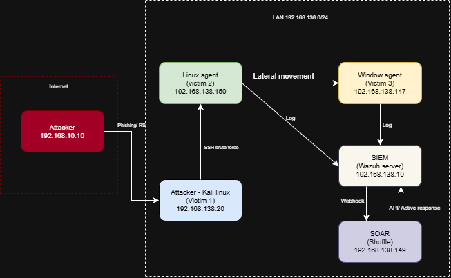

1. Mục đích thiết kế mạng
Môi trường mạng được thiết kế nhằm mô phỏng hệ thống mạng nội bộ của một doanh nghiệp vừa và nhỏ, trong đó kẻ tấn công đã có được chỗ đứng bên trong mạng (internal attacker / compromised host). Các mục tiêu cụ thể bao gồm:
- Mô phỏng kịch bản tấn công nội bộ thực tế: kẻ tấn công đã vượt qua perimeter và đang hoạt động bên trong mạng doanh nghiệp
- Cho phép thực hiện các kỹ thuật tấn công từ máy Attacker đến các máy nạn nhân trong cùng phân vùng mạng
- Thu thập và phân tích log tập trung thông qua Wazuh Server (SIEM)
- Tích hợp hệ thống tự động hóa phản ứng sự cố thông qua Shuffle (SOAR)
- Kiểm tra khả năng phát hiện tấn công của hệ thống dựa trên rule và tương quan sự kiện

2. Kiến trúc tổng thể
Toàn bộ môi trường lab được triển khai trên các máy ảo (VMware/VirtualBox), cấu hình trong cùng một dải mạng nội bộ 192.168.138.0/24. Các máy giao tiếp trực tiếp với nhau thông qua virtual switch mà không qua NAT hay routing phức tạp.
```
Thành phần    Vai trò               Hệ điều hành        IP                      Ghi chú
Kali        Attacker(victim1)         Kali Linux      192.168.138.20        Công cụ: Hydra, Nmap, Netcat
Windows     AgentVictim 2             Windows 10      192.168.138.147       Wazuh Agent, RDP enabled
Ubuntu      AgentVictim 3             Ubuntu 22.04    192.168.138.150       Wazuh Agent, SSH enabled
Wazuh Server    SIEM                  Ubuntu 22.04    192.168.138.10        Wazuh Manager + Dashboard
Shuffle         SOAR                  Ubuntu 22.04    192.168.138.149       Tự động hóa phản ứng sự cố
```

3. Phân vùng và luồng kết nối
Tất cả các máy nằm trong cùng một subnet 192.168.138.0/24, mô phỏng một flat network nội bộ điển hình trong doanh nghiệp nhỏ chưa áp dụng phân đoạn mạng (network segmentation).
Luồng tấn công:
- Kali Linux → Windows Agent: Brute Force qua RDP (port 3389)
- Kali Linux → Ubuntu Agent: Brute Force qua SSH (port 22)
- Windows Agent → Ubuntu Agent: Lateral Movement qua SSH/RDP sau khi chiếm được credential

Luồng giám sát:
- Windows Agent → Wazuh Server: Wazuh Agent gửi log liên tục về SIEM (port 1514)
- Ubuntu Agent → Wazuh Server: Wazuh Agent gửi log liên tục về SIEM (port 1514)

Luồng phản ứng:
- Wazuh Server → Shuffle: Khi phát hiện alert đạt ngưỡng, Wazuh gửi webhook đến Shuffle (port 443)
- Shuffle thực hiện các hành động tự động: gửi email cảnh báo, tạo ticket, ghi log sự cố

4. Mô hình kết nối



5. Lý do lựa chọn mô hình
Việc đặt tất cả máy trong cùng một subnet phẳng (flat network) là có chủ đích, nhằm:
- Đơn giản hóa môi trường lab: Không cần cấu hình routing phức tạp, tập trung vào kịch bản tấn công và phát hiện
- Phản ánh thực tế: Nhiều doanh nghiệp vừa và nhỏ vẫn vận hành flat network mà không có VLAN hay micro-segmentation
- Tối đa hóa khả năng quan sát: Wazuh Agent trên cả hai máy nạn nhân đảm bảo mọi sự kiện đều được thu thập và gửi về SIEM để phân tích