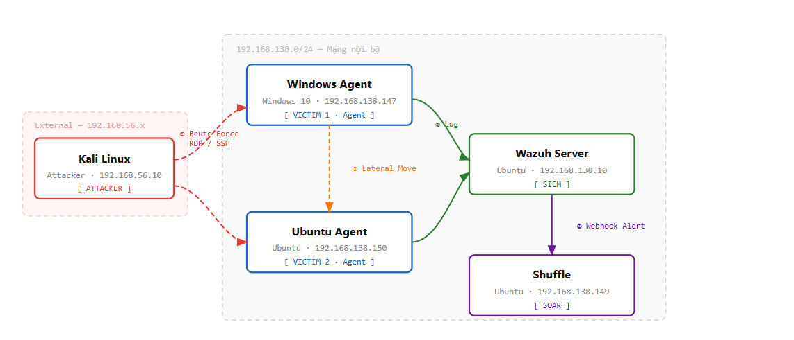

1. Mục đích thiết kế mạng
- Môi trường mạng được thiết kế nhằm:
- Mô phỏng hệ thống nội bộ trong doanh nghiệp
- Cho phép thực hiện tấn công từ máy Attacker đến các máy nạn nhân
- Thu thập và phân tích log tập trung thông qua Wazuh Server
- Tích hợp hệ thống tự động hóa phản ứng sự cố (Shuffle)

2. Kiến trúc tổng thể
Môi trường gồm các thành phần sau:
```
Thành phần	       Vai trò	      Hệ điều hành	IP
Kali Linux	       Attacker	      Kali Linux	192.168.56.10
Ubuntu agent	   Agent 1	      Ubuntu    	192.168.138.150
Windows agent  	   Agent 2	      Windows 10	192.168.138.147
Wazuh Server	   SIEM	          Ubuntu	    192.168.138.10
Shuffle	           SOAR	          Ubuntu	    192.168.138.149
```

Tất cả các máy được cấu hình trong cùng một mạng nội bộ.

3. mô hình kết nối
