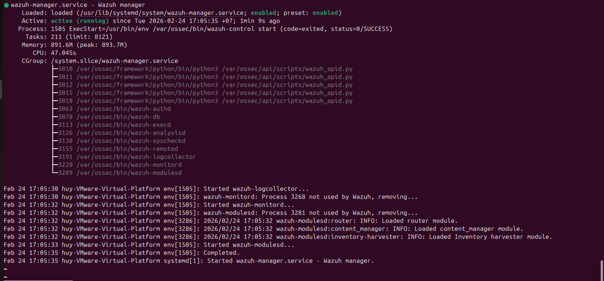
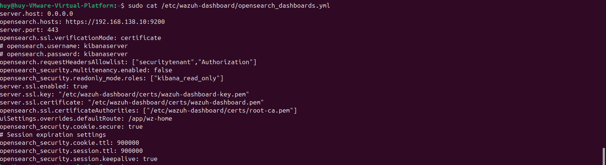
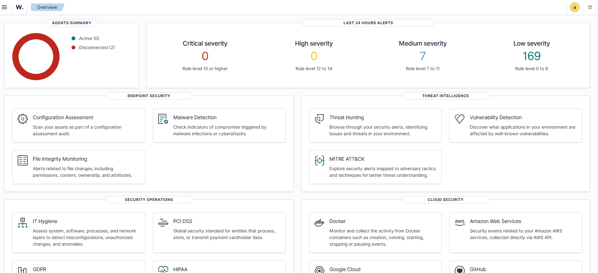

1. Yêu cầu hệ thống
```
Thành phần      Giá trị
OS              Ubuntu Server 22.04
IP Address      192.168.1.10
RAM             4GB
CPU             2 cores
Vai trò         Wazuh Manager + Indexer + Dashboard
```

3. Cài đặt Wazuh
3.1 Cập nhật hệ thống
    sudo apt update && sudo apt upgrade -y
3.2 Cài đặt Wazuh All-in-One
    curl -sO https://packages.wazuh.com/4.7/wazuh-install.sh
    sudo bash wazuh-install.sh -a

4. Kiểm tra dịch vụ
    sudo systemctl status wazuh-manager
    
    sudo systemctl status wazuh-indexer
    
    sudo systemctl status wazuh-dashboard
    

 5. Cấu hình Opensearch trỏ đúng API
    

 6. Truy cập dashboard: https://192.168.138.10:443
    
